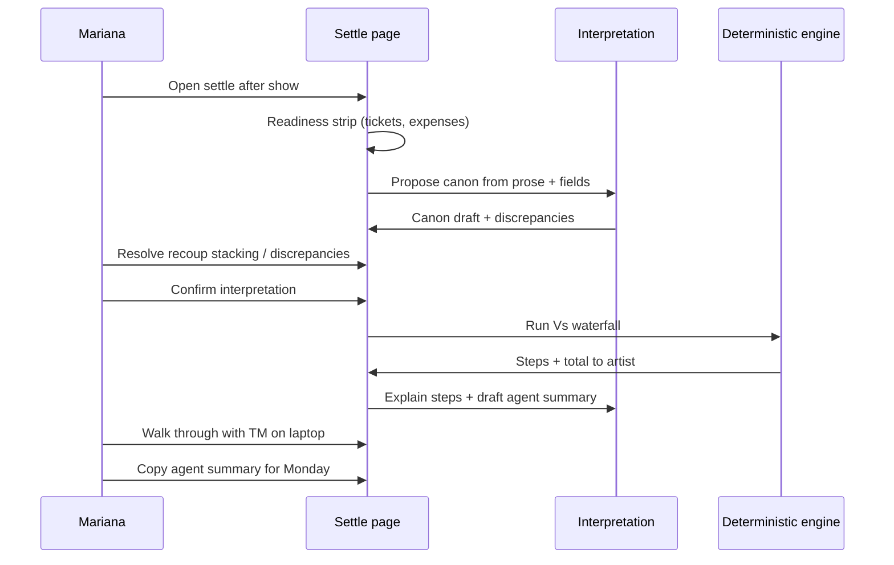

# UX workflow — Settlement confidence review

**Phase 3** · Primary user: **Mariana Reyes** · Surface: `/shows/[id]/settle`  
**Thesis:** [`product-thesis.md`](./product-thesis.md)

---

## Design intent

Mariana arrives at 2am with tickets and expenses in Greenroom and the deal in her head. The feature does **not** settle for her—it helps her **lock what the deal means**, **see what could start a fight**, and **walk the TM through defensible math** before she texts Marcus a number.

**Tone:** Calm operations tool, not copilot. Copy says “review” and “confirm,” never “auto-settle” or “AI calculated.”

---

## When Mariana uses this (journey)

| When | Where | Goal |
|------|--------|------|
| **Wednesday afternoon** (ideal) | Show detail or settle | Run confidence review early; email agent if ambiguous |
| **~12:30am post-show** (reality) | Settle page | Confirm canon → open worksheet on laptop with TM |
| **Monday** (follow-up) | Settle (return visit) | Copy agent summary; compare to dispute email |

**Entry:** Existing **“Settle show” / “View settlement”** on show detail—no new nav item.

---

## Page architecture (single scroll, top → bottom)

Preserves existing header, lifecycle bar, signoff, recoups. **Inserts a “Confidence review” block above payout math**—replacing or wrapping the current unsupported empty state for Vs.

```
┌─────────────────────────────────────────────────────────────┐
│ ← Back · Status badges · Settlement · {Artist} · Date       │
├─────────────────────────────────────────────────────────────┤
│ [Optional] Trust banner — TM signoff vs disputed (BC1)      │
├─────────────────────────────────────────────────────────────┤
│ Settlement lifecycle (existing, read-only)                  │
├─────────────────────────────────────────────────────────────┤
│ §1 READINESS STRIP — inputs OK? anomalies?                │
├─────────────────────────────────────────────────────────────┤
│ §2 DEAL INTERPRETATION — AI propose + Mariana confirm       │
├─────────────────────────────────────────────────────────────┤
│ §3 DISCREPANCIES — prose vs structured, ops flags           │
├─────────────────────────────────────────────────────────────┤
│ §4 CONFIDENCE GATE — overall score + blockers               │
├─────────────────────────────────────────────────────────────┤
│ §5 PAYOUT WALKTHROUGH — deterministic (locked until §4 OK)  │
├─────────────────────────────────────────────────────────────┤
│ §6 RECOUPS (existing, linked to interpretation)           │
├─────────────────────────────────────────────────────────────┤
│ §7 AGENT SUMMARY — generate / copy (after walkthrough)      │
├─────────────────────────────────────────────────────────────┤
│ Sign-off & notes (existing)                                 │
└─────────────────────────────────────────────────────────────┘
```

---

## 1. UI sections (detailed)

### §1 Readiness strip (always visible)

Compact horizontal checklist—not a wizard.

| Chip | Source | States |
|------|--------|--------|
| Box office | `ticket_sales` | ✓ gross/fees · ⚠ no sales · — |
| Expenses | `expenses` | ✓ N lines · ⚠ $0 or missing categories · ⚠ over hospitality cap (BC5) |
| Deal notes | `deal_notes_freetext` | ✓ present · ⚠ empty |
| Prior review | local/DB | ✓ confirmed {date} · ○ not started |

**AI output:** None (pure data). Optional rule tip: “Hospitality $620 over $400 cap—not marked absorbed.”

---

### §2 Deal interpretation (core)

**Card title:** “Deal interpretation”  
**Subtitle:** “What we’ll use for tonight’s math. Confirm or edit—this becomes the record.”

**Layout:** Two columns on desktop; stack on mobile.

| Left: Source | Right: Confirmed canon |
|--------------|------------------------|
| Collapsible **Agent notes** (`deal_notes_freetext`, monospace-friendly) | Editable fields mapped to settlement logic |
| Collapsible **Structured fields** (read-only grey, labeled “from booking form”) | |

**Canon fields (standard Vs v1):**

| Field | Control | Notes |
|-------|---------|-------|
| Deal structure | Read-only badge: “Vs — guarantee vs % of net” | If walkout/ratchet detected → amber “needs manual sheet” |
| Guarantee | Currency input | |
| Artist % | % input | |
| % basis | Net after fees & expenses | |
| Expense cap | Currency | |
| Fees deducted from | Gross (default) | |
| **Marketing recoup** | Amount + toggle: **Inside expense cap** / **Deducted before net (like fees)** / **None** | Coastal Spell control |
| Bonuses | List from JSON + prose flags | Unresolved → low confidence |

**AI outputs (initial load):**

```ts
// Conceptual — not implementation
{
  proposedCanon: { ... },
  extractionNotes: "Pulled $5k guarantee and 80% from prose line 1…",
  unsupportedClauses: ["walkout pot mentioned — not modeled"],
}
```

**User actions:**

- **Run interpretation** (first visit) or auto-run on page load
- Edit any canon field
- **Confirm interpretation** (primary button)—timestamp + user id; unlocks §5

---

### §3 Discrepancies (trust panel)

**Card title:** “Checks”  
Only shows items with findings—empty state: “No conflicts detected between notes and booking fields.”

| Severity | Example | UI |
|----------|---------|-----|
| **Blocking** | Prose 85/15 vs structured 75% (BC6) | Rose row + “Choose which % applies” inline in canon |
| **Blocking** | Prose Vs vs `deal_type` % of net (BC9) | Rose + “Use Vs for math” one-click |
| **Warning** | Bonus threshold prose ≠ `bonuses_json` (BC2) | Amber + link to bonus in canon |
| **Warning** | Marketing expense row + recoup line | Amber “avoid double-count” |
| **Info** | TM signoff positive but status disputed (BC1) | Blue banner at top (§ trust banner) |
| **Info** | Hospitality over cap | Amber in readiness |

**AI outputs:** List of `{ id, severity, title, body, suggestedResolution, fieldKeys? }`  
**Rule-based (no LLM):** regex + field comparison for BC patterns.

---

### §4 Confidence gate

**Card title:** “Settlement confidence”  
**Not a single ML score—a checklist Mariana understands.**

| Indicator | Logic |
|-----------|--------|
| Deal interpretation | ✓ Confirmed · ○ Draft |
| Blocking discrepancies | 0 open |
| Ambiguous recoup stacking | ✓ Explicit choice · ⚠ Unresolved |
| Expenses | ✓ Ready · ⚠ Over cap / missing |
| Unsupported deal flavor | ✓ Standard Vs · ⚠ Walkout/ratchet |

**Overall badge:**

| Level | Label | §5 behavior |
|-------|-------|-------------|
| **High** | Ready to walk through with TM | Walkthrough fully open |
| **Medium** | Review warnings before the back office | Walkthrough open, amber banner |
| **Low** | Resolve blockers first | Walkthrough collapsed; “Confirm interpretation and resolve blockers” |

**Human override:** “I’ve discussed this with the agent” checkbox on **Low** only—unlocks walkthrough with persistent “override” flag in saved JSON (audit).

---

### §5 Payout walkthrough (deterministic)

Replaces unsupported empty state for Vs when interpretation confirmed.

| Element | Behavior |
|---------|----------|
| Hero number | **Total to artist** — large mono |
| Step rows | Gross → fees → [recoup per stacking choice] → capped expenses → net → guarantee vs % → winner → bonuses |
| Dual preview (ambiguous recoup only) | Side-by-side: “If recoup inside cap” vs “If recoup before net” with **$ delta** until one chosen |
| Compare | If `settlements.total_to_artist` exists and differs → “Previously logged: $X” |
| Footer | `finalFormula` string (existing pattern) |

**AI output:** Natural-language **explanation** paragraph per step (generated after numbers fixed)—toggle “Show plain English” default on for TM screen share.

**Locked state:** Collapsed card with lock icon until §4 ≥ Medium (or override).

---

### §6 Recoups (existing + link)

Keep current `RecoupsSection`. Add one line under header:

> “Recoups on this show: **{canon.recoupStacking label}** · [Edit in interpretation]”

If settlement recoup `disputed` and canon says agreed → surface mismatch warning.

---

### §7 Agent summary

**Card title:** “Statement for the agent”  
**Subtitle:** “For Monday email—not sent automatically.”

**AI output (after walkthrough):** Markdown preview:

- Deal terms (confirmed canon, plain English)
- Box office / fees
- Expenses itemized
- Recoup line with stacking stated explicitly
- Total to artist
- Absorbed venue costs called out
- Footnote: “Tour manager sign-off: {signoff_text}” if present

**User actions:**

- **Generate summary** (requires confirmed interpretation + walkthrough)
- **Copy to clipboard**
- Optional: **Download .md** (case study scope)

---

## 2. User actions (summary)

| Action | Section | Effect |
|--------|---------|--------|
| Open settle page | — | Load readiness; trigger interpretation if no canon |
| Run / refresh interpretation | §2 | AI propose canon |
| Edit canon field | §2 | Mark interpretation “draft”; recompute confidence |
| Confirm interpretation | §2 | Persist canon; refresh discrepancies + walkthrough |
| Resolve discrepancy (pick %, deal type, etc.) | §3 | Clear blocker; update canon |
| Choose recoup stacking | §2 or §5 dual preview | Set canon; collapse dual preview |
| Acknowledge override (low confidence) | §4 | Unlock walkthrough with audit flag |
| Expand “plain English” steps | §5 | Toggle explanation |
| Generate / copy agent summary | §7 | Clipboard |
| (Out of scope v1) Submit to agent, change lifecycle | — | — |

**Not in v1:** Auto-advance lifecycle, email send, TM share link.

---

## 3. AI outputs (what the model does vs code)

| Output | Producer | When |
|--------|----------|------|
| Proposed canon fields | LLM + schema validation | §2 load |
| Extraction rationale (1–2 sentences) | LLM | §2 footer |
| Unsupported clause callouts | Rules + LLM | §2 banner |
| Discrepancy list | Rules primary; LLM enriches message | §3 |
| Step explanations | LLM from deterministic steps | §5 |
| Agent summary prose | LLM from canon + numbers | §7 |
| **Payout dollars** | **Code only** | §5 |

**Transparency:** Small “How this was interpreted” link expands prompt inputs (deal notes excerpt)—for case study honesty, optional in prod.

---

## 4. Warning states

| ID | Trigger | Placement | Copy direction |
|----|---------|-----------|----------------|
| W1 | `deal_type` unsupported flavor in prose | §2 top | “This deal mentions a walkout pot. Math below covers standard Vs only.” |
| W2 | Blocking discrepancy open | §4 | “Resolve {n} items before walking the TM through totals.” |
| W3 | Recoup stacking unset + recoup amount > 0 | §2 + §5 | “Marketing recoup stacking not chosen—Coastal-style disputes start here.” |
| W4 | Hospitality over cap, not absorbed | §1 + §3 | “Hospitality is ${over} over cap—decide absorb vs pass-through before settle.” |
| W5 | `total_to_artist` ≠ walkthrough | §5 | “Logged total differs from worksheet by ${delta}.” |
| W6 | BC1 signoff vs disputed | Page top | “TM signed off at the room; agent disputed later—see notes.” |
| W7 | Paid + disputed recoup (BC3) | §6 | “Paid out but recoup still contested—outstanding liability.” |
| W8 | No `AI_API_KEY` / API fail | §2 | Degraded: rules-only extraction; banner “Limited review—AI unavailable.” |

---

## 5. Human override points (non-negotiable)

1. **Every canon field editable** after AI propose.
2. **Confirm interpretation** required before walkthrough (except explicit low-confidence override with reason).
3. **Recoup stacking** — no default when prose ambiguous; Mariana must click a option (Coastal: show both payouts first).
4. **Discrepancy resolution** — blocking items require explicit choice, not dismiss.
5. **Agent summary** — generate on demand; Mariana copies; no auto-send.
6. **Override checkbox** — optional text: “Spoke with agent” (short, not required essay).

---

## 6. Empty / loading / error states

### §2 Interpretation

| State | UI |
|-------|-----|
| **Loading** | Skeleton canon fields; “Reading deal notes…” (8–15s max; show cancel) |
| **Empty notes** | “No deal notes—add terms on show page before confidence review.” Link to `/shows/[id]` |
| **Error (API)** | Rules-only fallback card + “Retry AI interpretation” |
| **Confirmed (return visit)** | Canon read-only with “Edit interpretation” secondary |

### §3 Discrepancies

| State | UI |
|-------|-----|
| **Empty (good)** | Green subtle check: “Notes and booking fields align.” |
| **Loading** | Inherits §2; spinner inline |

### §5 Walkthrough

| State | UI |
|-------|-----|
| **Locked** | Grey card: “Confirm deal interpretation to see payout walkthrough.” |
| **Unsupported flavor** | Amber: keep “What the system has” inputs grid from current `UnsupportedDeal` below interpretation |
| **Zero gross** | “No ticket sales yet—walkthrough updates when box office closes.” |

### §7 Agent summary

| State | UI |
|-------|-----|
| **Idle** | “Generate statement” disabled until interpretation confirmed |
| **Loading** | “Drafting statement…” |
| **Ready** | Markdown preview + Copy |

---

## Flow diagram (happy path — standard Vs, 2am)



---

## Integration with existing UI

| Existing | Change |
|----------|--------|
| Unsupported Vs empty state | **Replace** with §1–§7; retire “can’t settle” as first impression |
| Supported flat / % gross | Insert §1–§4 lighter (fewer fields); §5 uses existing `calculateSettlement` |
| Lifecycle bar | Keep; no actions |
| Recoups / signoff | Keep; wire to canon |
| Footer case-study CTA | Keep below fold or remove in fork |

---

## Coastal Spell demo path (Loom)

1. Open `show_coastal_spell_dispute` — disputed badge + W6 banner.  
2. §3 flags marketing recoup ambiguity.  
3. §5 dual preview: $11,565 vs $12,285.  
4. Mariana selects “inside cap” → $12,285 matches logged settlement.  
5. Generate agent summary with explicit recoup language.  

---

## v1 scope cut (UX)

- No tabbed wizard; single scroll.  
- No TM-facing view.  
- No lifecycle buttons.  
- No inline expense editing (link to show page).  
- Wednesday pre-flight = same settle page accessed before show date (readiness W4 only).

---

## Implementation map (for Phase 4)

| UX section | Component (suggested) |
|------------|----------------------|
| §1 | `ReadinessStrip.tsx` |
| §2–§4 | `ConfidenceReviewPanel.tsx` |
| §5 | `PayoutWalkthrough.tsx` + extend `dealMath.ts` |
| §7 | `AgentSummaryCard.tsx` |
| State | `interpretation` in DB or session JSON on settlement row |
